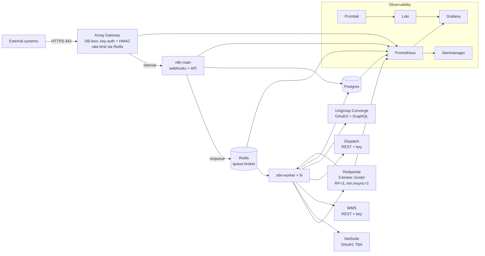

# Gateway — Integration Platform

In-house integration platform: **Kong** (DB-less) → **Redpanda** (3-node Kafka cluster, 1 node by default) → **n8n** (single-process by default; queue mode + N workers under the `ha` profile), backed by Postgres + Redis and a full Prometheus / Grafana / Loki observability stack.

**Integrations:** Samsara • NetSuite (OAuth1 TBA) • Unigroup Converge (OAuth2 + GraphQL) • WMS • Dispatch • Custom APIs

**Credential management:** [`admin-ui/`](admin-ui/README.md) — unified read/write across `.env`, n8n credentials, and Kong consumers, with append-only audit + rotate-with-healthcheck + one-click restart. Profile-gated, loopback-only.

> **Status:** HA-capable stack (3-broker Redpanda + queue-mode n8n workers +
> shared rate-limit counters — all available under the `ha` profile) running
> on a single host via `docker-compose` for staging / small-scale production.
> **True HA requires ≥3 hosts**: on a single host the box itself is a SPOF
> regardless of replication. **Measured baseline on the default (non-HA)
> stack: ~240 rps sustained, p95 ≈ 0.55s, 0% errors** — see
> [`docs/performance.md`](docs/performance.md) for the full run and
> what to change to go higher. Review
> [`docs/SECURITY.md`](docs/SECURITY.md) and
> [`docs/DEPLOYMENT-CHECKLIST.md`](docs/DEPLOYMENT-CHECKLIST.md) before
> pointing real traffic at any instance you don't control end-to-end.

---

## Contents

- [Architecture](#architecture)
- [Quick start](#quick-start)
- [Services](#services)
- [Configuration](#configuration)
- [Scaling](#scaling)
- [Security posture](#security-posture)
- [Observability](#observability)
- [Performance](#performance)
- [Operations](#operations)
- [Repo layout](#repo-layout)

---

## Architecture



Key properties:

- **Kong is DB-less.** All routes, plugins, consumers, and API keys live in [`kong/kong.yml`](kong/kong.yml). There is no `kong-database` container.
- **Redpanda is a 3-broker cluster under `--profile ha`**, single-broker by default. Topics created under `ha` use `replication=3, min.insync.replicas=2, compression=zstd`; under the default profile they fall back to the broker count.
- **n8n defaults to regular (single-process) mode.** The `ha` profile switches it to queue mode and starts N `n8n-worker` containers — execution is dispatched via Redis to the workers. Webhook registration also depends on this mode matching the number of running workers; the default (regular, no workers) is the simpler, reliably-boots-from-scratch path.
- **Admin UIs are loopback-only.** Kong admin (8001/8002), n8n (5678), Redpanda Console (8080), Grafana (3002), Prometheus (9090), Alertmanager (9093), and Loki (3100) bind to `127.0.0.1` on the host. Only the public proxy on 8000/8443 listens on `0.0.0.0`.
- **Every public route is auth'd and rate-limited.** `key-auth` + redis-backed `rate-limiting` + `request-size-limiting` + `cors` + security headers + `ip-restriction` + `correlation-id` are applied globally; Samsara additionally has an HMAC pre-function plugin.

---

## Quick start

```bash
cp .env.example .env               # then replace every CHANGE_ME, including N8N_OWNER_*
./scripts/setup.sh                 # generates dev TLS cert, starts stack, creates topics
./scripts/n8n-bootstrap.sh         # one-time: owner + kafka cred + workflow activation
./scripts/test.sh                  # smoke test
```

`setup.sh` will:
1. Verify Docker.
2. Generate `config/kong/certs/server.{crt,key}` (self-signed, for dev only).
3. `docker compose up -d --wait`.
4. Create Redpanda topics with production settings.

`n8n-bootstrap.sh` is idempotent and handles the parts n8n's CLI can't:
owner account setup on first run, the Redpanda Kafka credential, import
of every `workflows/*.json`, and webhook registration via REST (the CLI
`import:workflow` / `update:workflow --active=true` path marks a workflow
active in the DB but does **not** register its webhook — known n8n
issue #21614). Safe to re-run: existing state is detected and reused.

To scale n8n workers (HA): `docker compose --profile ha up -d --scale n8n-worker=4`.
Worker containers only exist under the `ha` profile.

Edit `kong/kong.yml` → apply with `./scripts/kong-setup.sh` (hot reload via loopback admin API).

### Optional: start the admin UI

```bash
docker compose --profile admin up -d admin-ui
open http://127.0.0.1:7070         # requires ADMIN_UI_USER / ADMIN_UI_PASSWORD in .env
```

Read/write credential management across `.env`, n8n credentials, and Kong
consumers, with rotate-with-healthcheck and an audit log. See
[`admin-ui/README.md`](admin-ui/README.md) for the full flow.

### Optional: replay a canned Samsara payload through the funnel

```bash
./scripts/samsara-replay.sh              # HTTP 202 expected (Kong HMAC + key-auth + n8n + Kafka)
TAMPER=1 ./scripts/samsara-replay.sh     # HTTP 401 expected (proves HMAC rejects)
docker exec gateway-redpanda-0 rpk topic consume samsara-events \
  --brokers redpanda-0:29092 -n 1 -f '%v\n'
```

Same script runs as part of CI's Smoke job.

### Optional: auto-create Zammad helpdesk tickets on critical alerts

Severity-gated + fingerprint-deduped so the helpdesk doesn't get noise.

```bash
# 1. Mint a token in Zammad: Profile -> Token Access, perm = ticket.agent
# 2. Add to .env:
#    ZAMMAD_URL=https://helpdesk.goarmstrong.com
#    ZAMMAD_API_TOKEN=<token>
#    ZAMMAD_GROUP=Users
#    ZAMMAD_CUSTOMER=info@goarmstrong.com
# 3. Restart n8n so it picks up the env
docker compose up -d n8n                      # add n8n-worker under --profile ha
# 4. The Alertmanager -> Zammad workflow is imported + activated by
#    ./scripts/n8n-bootstrap.sh already. If you skipped bootstrap or
#    the workflow got deactivated, re-run it:
./scripts/n8n-bootstrap.sh
```

Full walkthrough + end-to-end curl test + tuning guide in
[`docs/alerting-to-zammad.md`](docs/alerting-to-zammad.md).

---

## Services

| Service           | Port (exposed)      | Role                                   |
|-------------------|---------------------|----------------------------------------|
| Kong proxy        | `0.0.0.0:8000/8443` | **Public** - HTTPS API gateway         |
| Kong admin        | `127.0.0.1:8001`    | Admin API (tunnel to reach)            |
| Kong manager      | `127.0.0.1:8002`    | Web UI                                 |
| n8n main          | `127.0.0.1:5678`    | Workflow editor + webhook frontend     |
| n8n-worker        | –                   | Queue workers (`--profile ha` only; replicas configurable) |
| Postgres          | internal            | n8n state                              |
| Redis             | internal            | Queue broker + Kong rate-limit counters|
| Redpanda 0/1/2    | internal (`:9092` on node-0 loopback) | Kafka cluster            |
| Redpanda Console  | `127.0.0.1:8080`    | Topic / message inspector              |
| Prometheus        | `127.0.0.1:9090`    | Metrics                                |
| Alertmanager      | `127.0.0.1:9093`    | Alert routing (Slack / PagerDuty)      |
| Grafana           | `127.0.0.1:3002`    | Dashboards + log explorer              |
| Loki              | `127.0.0.1:3100`    | Log aggregation                        |
| Promtail          | internal            | Docker log shipping → Loki             |
| node-exporter     | internal            | Host metrics                           |
| cAdvisor          | internal            | Container metrics                      |
| postgres-exporter | internal            | Postgres metrics                       |
| redis-exporter    | internal            | Redis metrics                          |
| admin-ui          | `127.0.0.1:7070` (opt-in, `--profile admin`) | Unified credential/audit/restart UI |

To reach a loopback-bound UI from a workstation:
```bash
ssh -L 3002:127.0.0.1:3002 -L 8001:127.0.0.1:8001 -L 5678:127.0.0.1:5678 prod-host
```

---

## Configuration

All tunables are environment variables consumed by `docker-compose.yml`:

- **Application secrets** → `.env` (gitignored). In production inject via AWS Secrets Manager / Vault / SSM — the compose file already reads `${VAR}` so this is a drop-in.
- **Kong routes / plugins / consumers** → `kong/kong.yml`.
- **Prometheus scrape + rules** → `config/prometheus/prometheus.yml`, `config/prometheus/rules/*.yml`.
- **Alert routing** → `config/alertmanager/alertmanager.yml` (uses `ALERTMANAGER_SLACK_WEBHOOK`, `ALERTMANAGER_PAGERDUTY_KEY`).
- **Log pipeline** → `config/loki/loki-config.yaml`, `config/promtail/promtail.yml`.
- **Grafana datasources / dashboards** → `config/grafana/provisioning/`.
- **Kafka topic layout** → `scripts/create-topics.sh`.

### Rotating an API key — two ways

**A. Through the admin UI (recommended; includes healthcheck + audit):**
```bash
docker compose --profile admin up -d admin-ui
open http://127.0.0.1:7070     # Credentials → Edit/Rotate → Apply
```

**B. By hand:**
1. Edit the relevant consumer block in `kong/kong.yml` (replace the `key:` value).
2. `./scripts/kong-setup.sh` (hot reload).
3. Distribute the new key to the caller.

### Adding a route

Append a new `services:` entry in `kong/kong.yml` with its own `routes:` — the global plugin block will auto-apply auth + rate-limit + size + cors + headers + ip-restriction. Then `./scripts/kong-setup.sh`.

### Kafka topics

Defined in [`scripts/create-topics.sh`](scripts/create-topics.sh):

| Topic              | Partitions | Retention | Purpose                              |
|--------------------|------------|-----------|--------------------------------------|
| `samsara-events`   | 24         | 7d        | Inbound Samsara webhooks (by vehicle)|
| `orders`           | 12         | 30d       | Order events (NetSuite, WMS, ...)    |
| `inventory`        | 6          | 7d        | Stock adjustments                    |
| `netsuite-updates` | 12         | 7d        | NetSuite change feed                 |
| `unigroup-out`     | 6          | 30d       | Messages for Unigroup outbound       |
| `unigroup-in`      | 6          | 7d        | Unigroup responses + polled status   |
| `wms-out`          | 6          | 30d       | Messages for WMS outbound            |
| `wms-updates`      | 6          | 7d        | WMS responses                        |
| `dispatch-out`     | 6          | 30d       | Messages for Dispatch outbound       |
| `dispatch-updates` | 6          | 7d        | Dispatch responses                   |
| `errors-dlq`       | 3          | 90d       | Dead-letter queue, forensic          |

---

## Scaling

- **Kong**: stateless in DB-less mode. Run ≥ 2 replicas behind an L4/L7 LB. `docker compose up -d --scale kong=N`.
- **n8n workers**: switch n8n to queue mode and start workers with `docker compose --profile ha up -d --scale n8n-worker=N`. Each worker processes up to `--concurrency=10` jobs in parallel. The measured default (single-process, `~240 rps`) scales roughly linearly per worker — see [`docs/performance.md`](docs/performance.md).
- **Redpanda**: increase partition counts in `scripts/create-topics.sh` and scale brokers horizontally (`--profile ha` brings up 3 brokers; default runs 1). `samsara-events` defaults to 24 partitions keyed on `vehicle_id`.
- **Postgres**: migrate to a managed service (RDS / CloudSQL) before significant write load.

---

## Security posture

Summary (full details in [`docs/SECURITY.md`](docs/SECURITY.md)):

- Admin surfaces bound to loopback only.
- Kong DB-less + declarative → no runtime admin-API writes in prod.
- `key-auth` + redis-shared `rate-limiting` + `request-size-limiting` + HSTS/CSP + `ip-restriction` on every route.
- Samsara HMAC verified in a Kong `pre-function` before n8n ever sees the request.
- PII (driver names, formatted addresses) redacted before publish to Kafka.
- `N8N_ENCRYPTION_KEY` set so n8n credentials are encrypted at rest.
- `scram-sha-256` on Postgres.
- TLS-only routes; modern cipher suite.
- gitleaks + Trivy (config/fs/image) in CI as **blocking** gates.
- Backups encrypted with `age` when `BACKUP_AGE_RECIPIENT` is set.

---

## Observability

- **Metrics**: Prometheus scrapes Kong, n8n, Redpanda (all 3 nodes), Postgres, Redis, node-exporter, cAdvisor, Alertmanager, Loki.
- **Alerts**: `config/prometheus/rules/gateway.rules.yml` covers 5xx rate, p95 latency, consumer lag, under-replicated partitions, queue backlog, workflow error rate, disk/memory, container restart loops, Postgres/Redis down.
- **Logs**: Promtail discovers every container via the Docker socket and ships to Loki with `correlation-id` extraction.
- **Dashboards**: provisioned from `config/grafana/dashboards/`.

Slack + PagerDuty receivers are wired in `config/alertmanager/alertmanager.yml`; populate `ALERTMANAGER_SLACK_WEBHOOK` / `ALERTMANAGER_PAGERDUTY_KEY` in `.env`.

---

## Performance

Measured baseline for the default (single-broker Redpanda, single n8n process)
stack on a Mac dev host:

- **~240 req/s sustained**, 0% errors across 112,500 requests
- **p50 ≈ 0.43s, p95 ≈ 0.55s, p99 ≈ 0.82s** at saturation
- Ceiling is Little's Law (100 concurrent × 0.43s ≈ 232 rps), not container
  CPU — Kong peaked at 14%, n8n at 4%, Redpanda <1%

To go higher: `docker compose --profile ha up -d --scale n8n-worker=N`
(queue mode + parallel workers). Full methodology, per-stage breakdown,
and headroom guidance in [`docs/performance.md`](docs/performance.md).
Reproduce with `./scripts/load-test.sh`.

---

## Operations

```bash
# Preflight
./scripts/validate-config.sh

# Daily / CI
./scripts/test.sh

# Backups (encrypted if BACKUP_AGE_RECIPIENT set; prunes > BACKUP_RETENTION_DAYS)
./scripts/backup.sh
./scripts/restore.sh ./backups/<ts>

# Redpanda
docker exec gateway-redpanda-0 rpk cluster health --brokers redpanda-0:29092
docker exec gateway-redpanda-0 rpk topic describe samsara-events --brokers redpanda-0:29092
docker exec gateway-redpanda-0 rpk group list --brokers redpanda-0:29092

# Kong hot reload
./scripts/kong-setup.sh

# Scale (n8n workers require --profile ha)
docker compose --profile ha up -d --scale n8n-worker=4 --scale kong=2

# Load-test the full path (curl -> Kong -> HMAC -> n8n -> Kafka -> 202)
./scripts/load-test.sh     # see docs/performance.md for baseline numbers
```

A cron template for daily backups is provided at `scripts/cron/gateway-crontab`.

---

## Repo layout

```
.
├── docker-compose.yml               # Full HA topology
├── kong/kong.yml                    # DB-less declarative Kong config
├── config/
│   ├── kong/certs/                  # TLS (self-signed for dev; real certs in prod)
│   ├── prometheus/
│   │   ├── prometheus.yml
│   │   └── rules/gateway.rules.yml
│   ├── alertmanager/alertmanager.yml
│   ├── grafana/
│   │   ├── provisioning/{datasources,dashboards}/
│   │   └── dashboards/
│   ├── loki/loki-config.yaml
│   └── promtail/promtail.yml
├── workflows/                       # n8n workflow exports
│   ├── samsara-webhook-to-kafka.json        # inbound: /samsara -> Kafka
│   ├── samsara-to-netsuite-pattern.json     # reference pattern
│   ├── netsuite-webhook-to-kafka.json       # inbound: NetSuite UE script -> /netsuite
│   ├── netsuite-create-sales-order.json     # outbound: orders topic -> NetSuite
│   ├── unigroup-outbound.json               # outbound: unigroup-out -> Keycloak + GraphQL
│   ├── wms-outbound.json                    # outbound: wms-out -> WMS REST
│   ├── dispatch-outbound.json               # outbound: dispatch-out -> Dispatch REST
│   └── samples/                             # canned payloads for replay tests
├── admin-ui/                        # Unified credential management (opt-in)
│   ├── index.html                           # static SPA
│   ├── README.md                            # full flow + API reference
│   └── backend/                             # FastAPI + SQLite audit + docker-socket restart
├── scripts/
│   ├── setup.sh                     # first-time setup (TLS cert + up)
│   ├── n8n-bootstrap.sh             # idempotent: owner + kafka cred + workflow activation via REST
│   ├── load-test.sh                 # walk-up load test; generates docs/performance.md-style report
│   ├── test.sh                      # smoke test (supports rate-limit probe when SMOKE_API_KEY set)
│   ├── samsara-replay.sh            # sign + POST a canned Samsara payload through Kong
│   ├── validate-config.sh           # preflight
│   ├── create-topics.sh             # partitions=N, RF=3, min.insync=2, zstd
│   ├── kong-setup.sh                # hot-reload kong/kong.yml
│   ├── backup.sh                    # age-encrypted; retention-enforced; refuses plaintext by default
│   ├── restore.sh
│   └── cron/gateway-crontab
├── docs/
│   ├── SECURITY.md                  # controls in place + pre-prod checklist
│   ├── DEPLOYMENT-CHECKLIST.md
│   ├── getting-started.md
│   ├── performance.md               # measured baseline for the default stack
│   ├── kong-plugins.md              # reference
│   ├── netsuite-integration.md      # TBA + User Event inbound template
│   ├── samsara-integration.md
│   ├── unigroup-integration.md      # Converge (OAuth2 + GraphQL) setup + message shape
│   └── workflow-resilience.md
└── .github/workflows/ci.yml         # gitleaks + Trivy (blocking on new CRITICAL) + smoke + samsara-replay
```

---

## License

Internal - all rights reserved.
