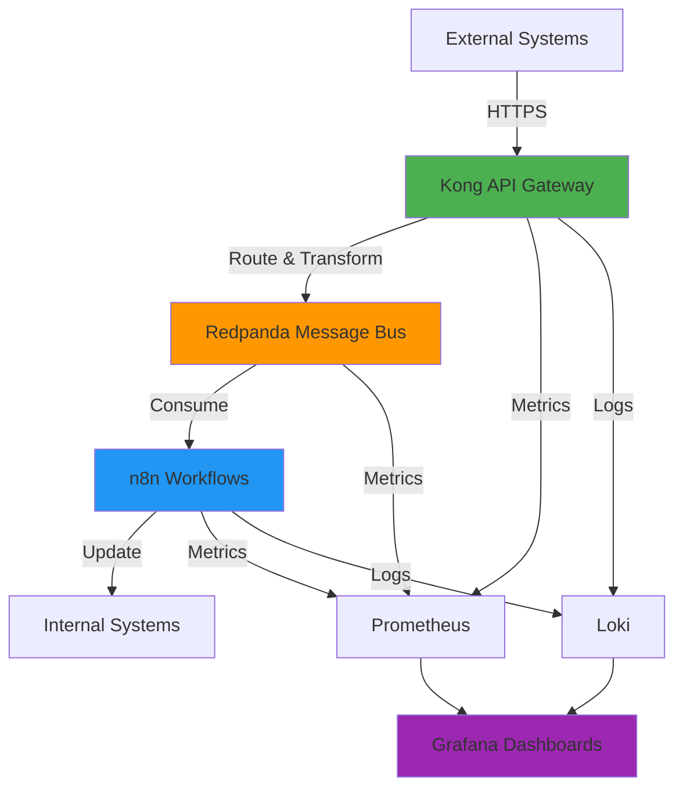
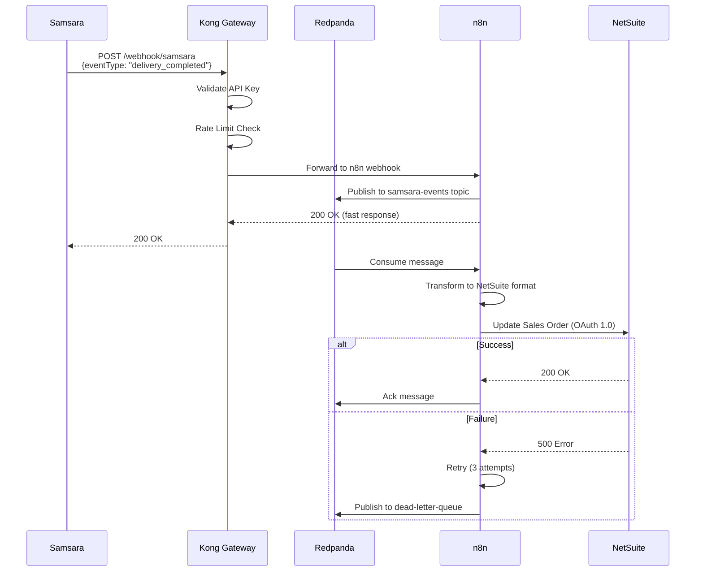
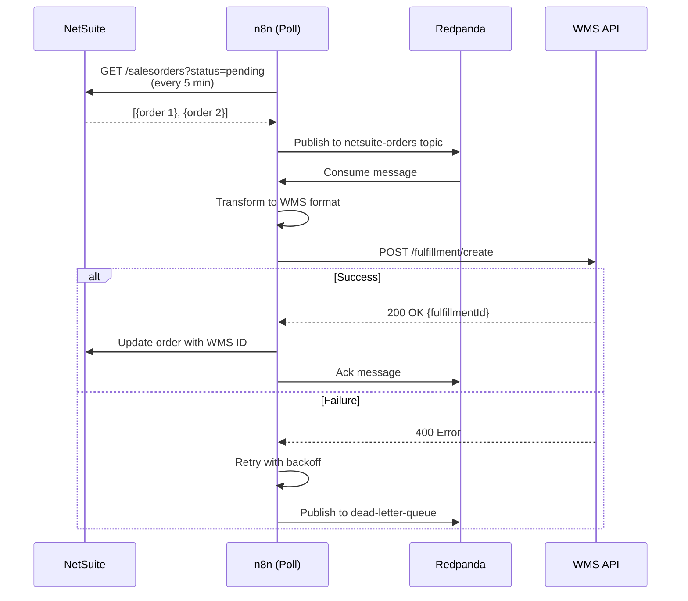
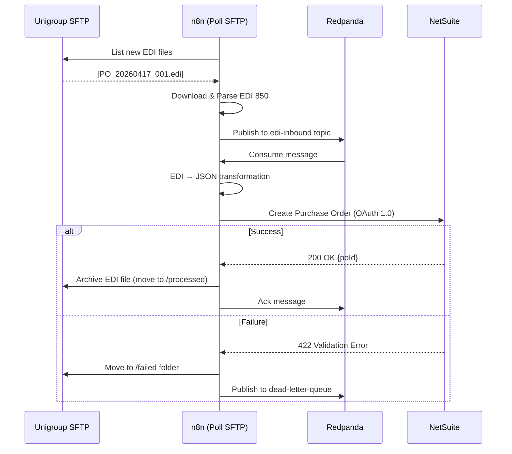

# Gateway - Integration Platform

> **⚠️ Current Status:** Development/Staging Only - See [Security Guide](docs/SECURITY.md) before production use

An in-house integration platform replacing Team Central, built with Kong API Gateway, Redpanda (Kafka), and n8n workflow orchestration.

**Integrations:** Samsara • NetSuite • Unigroup EDI • WMS • Custom APIs

---

## 📋 Table of Contents

- [Architecture](#architecture)
- [Quick Start](#quick-start)
- [Components](#components)
- [Integration Flows](#integration-flows)
- [Security](#security)
- [Monitoring](#monitoring)
- [Development](#development)
- [Production Readiness](#production-readiness)

---

## 🏗️ Architecture

### System Overview



### Component Architecture

```
┌─────────────────────────────────────────────────────────────┐
│                     External Systems                         │
│  Samsara • NetSuite • Unigroup • WMS • Custom APIs          │
└──────────────────┬──────────────────────────────────────────┘
                   │ HTTPS/Webhooks
                   ↓
┌─────────────────────────────────────────────────────────────┐
│                   Kong API Gateway (Port 8000)               │
│  • Authentication (API Keys, OAuth, Basic)                   │
│  • Rate Limiting (per consumer, per route)                   │
│  • Request Transformation                                    │
│  • TLS Termination                                          │
│  • Logging & Metrics                                        │
└──────────────────┬──────────────────────────────────────────┘
                   │
                   ↓
┌─────────────────────────────────────────────────────────────┐
│           Redpanda Message Bus (Kafka Compatible)            │
│  Topics:                                                     │
│  • samsara-events         (vehicle locations, alerts)        │
│  • netsuite-orders        (sales orders, invoices)           │
│  • inventory-updates      (stock changes)                    │
│  • edi-inbound           (Unigroup EDI 850/856)             │
│  • dead-letter-queue     (failed messages)                   │
└──────────────────┬──────────────────────────────────────────┘
                   │
                   ↓
┌─────────────────────────────────────────────────────────────┐
│                  n8n Workflow Orchestration                  │
│  • NetSuite Integration (OAuth 1.0)                         │
│  • Samsara Integration (API Token)                          │
│  • WMS Integration                                          │
│  • Data Transformation (JSON ↔ EDI ↔ Custom)               │
│  • Error Handling & Retry Logic                            │
│  • Dead Letter Queue Processing                            │
└──────────────────┬──────────────────────────────────────────┘
                   │
                   ↓
┌─────────────────────────────────────────────────────────────┐
│                    Internal Systems                          │
│  • NetSuite ERP                                             │
│  • Warehouse Management System                              │
│  • Internal Databases                                       │
└─────────────────────────────────────────────────────────────┘

┌─────────────────────────────────────────────────────────────┐
│                      Observability Stack                     │
│  Prometheus (metrics) → Grafana (dashboards)                │
│  Loki (logs) → Grafana (log search)                        │
└─────────────────────────────────────────────────────────────┘
```

---

## 🚀 Quick Start

### Prerequisites

1. **Docker Desktop** installed and running
   - Mac: [Download Docker Desktop](https://www.docker.com/products/docker-desktop/)
   - Windows: [Download Docker Desktop](https://www.docker.com/products/docker-desktop/) (WSL2 required)
   - Linux: `sudo apt install docker.io docker-compose`

2. **Git** (to clone this repo)

### Installation

```bash
# 1. Clone the repository
git clone https://github.com/ciscosanchez/gateway.git
cd gateway

# 2. Copy environment template
cp .env.example .env

# 3. Edit .env with your API keys (see .env.example for details)
nano .env  # or use your preferred editor

# 4. Start all services
docker compose up -d

# 5. Wait for services to be healthy (~2 minutes)
docker compose ps

# 6. Set up Kong routes
./scripts/kong-setup.sh

# 7. Run tests
./scripts/test.sh
```

### Access the Services

| Service | URL | Default Credentials | Purpose |
|---------|-----|-------------------|---------|
| **Kong Proxy** | http://localhost:8000 | Route-specific | API Gateway (public traffic) |
| **Kong Admin API** | http://localhost:8001 | None (⚠️ dev only) | Configuration API |
| **Kong Manager** | http://localhost:8002 | None (⚠️ dev only) | Web UI for Kong |
| **n8n Workflows** | http://localhost:5678 | admin / admin | Visual workflow builder |
| **Redpanda Console** | http://localhost:8080 | None | Kafka message viewer |
| **Grafana** | http://localhost:3002 | admin / admin | Monitoring dashboards |
| **Prometheus** | http://localhost:9090 | None | Metrics database |

---

## 🧩 Components

### Kong API Gateway

**Purpose:** Secure API ingress point with auth, rate limiting, and routing

**Key Features:**
- API key / OAuth / Basic authentication
- Rate limiting (per consumer, per IP, global)
- Request/response transformation
- Plugin ecosystem (50+ plugins)
- High performance (10k+ req/sec)

**Configuration:**
- Services: Define upstream APIs
- Routes: URL paths and matching rules
- Plugins: Auth, rate limiting, logging, etc.

**Example:**
```bash
# Create service
curl -X POST http://localhost:8001/services \
  --data name=samsara-api \
  --data url=http://n8n:5678/webhook/samsara

# Create route
curl -X POST http://localhost:8001/services/samsara-api/routes \
  --data paths[]=/samsara

# Add API key auth
curl -X POST http://localhost:8001/routes/{route-id}/plugins \
  --data name=key-auth
```

See [Kong Plugin Examples](docs/kong-plugins.md) for more.

---

### Redpanda (Kafka)

**Purpose:** Message bus for async communication and event buffering

**Key Features:**
- Kafka API compatible
- Built-in HTTP Proxy for REST access
- Schema Registry support
- Lower resource usage than Apache Kafka
- Single-binary deployment

**Topics:**
- `samsara-events`: Vehicle locations, alerts, driver assignments
- `netsuite-orders`: Sales orders, invoices, fulfillments
- `inventory-updates`: Stock level changes
- `edi-inbound`: Unigroup EDI documents (850, 856, etc.)
- `dead-letter-queue`: Failed messages for manual review

**Example:**
```bash
# List topics
docker exec -it gateway-redpanda rpk topic list

# Create topic
docker exec -it gateway-redpanda rpk topic create my-topic \
  --partitions 3 \
  --replicas 1

# Publish message
echo '{"event": "test"}' | docker exec -i gateway-redpanda \
  rpk topic produce my-topic
```

View messages in real-time: http://localhost:8080

---

### n8n Workflow Orchestration

**Purpose:** Visual workflow builder for integration logic

**Key Features:**
- 500+ pre-built integrations
- Visual drag-and-drop editor
- JavaScript for custom logic
- Error handling and retry logic
- Scheduled triggers (cron)
- Webhook triggers

**Example Workflows:**
- `workflows/samsara-fleet-dashboard.json`: Pull vehicle data every 5 min
- `workflows/netsuite-create-sales-order.json`: Process orders from Kafka → NetSuite
- `workflows/samsara-to-netsuite.json`: Sync Samsara events to NetSuite

**Import a workflow:**
1. Open http://localhost:5678
2. Click "Add Workflow" → "Import from File"
3. Select a JSON file from `workflows/`
4. Click "Execute Workflow" to test

---

### PostgreSQL

**Purpose:** State storage for n8n and Kong

**Databases:**
- `gateway`: n8n workflows and execution history
- `kong`: Kong configuration (services, routes, plugins)

**Backups:** See [Production Readiness](#production-readiness)

---

### Observability Stack

#### Prometheus (Metrics)

Collects metrics from:
- Kong (`/metrics` endpoint)
- Redpanda (JMX metrics on port 9644)
- Custom exporters (can add postgres_exporter, etc.)

**Query metrics:** http://localhost:9090

#### Grafana (Dashboards)

Pre-configured data sources:
- Prometheus (metrics)
- Loki (logs)

**View dashboards:** http://localhost:3002

#### Loki (Logs)

Log aggregation from all services.

**Search logs:** http://localhost:3002 → Explore → Loki

---

## 🔄 Integration Flows

### 1. Samsara Webhook → NetSuite

**Use Case:** When a delivery is completed in Samsara, update the NetSuite sales order status



**Files:**
- `workflows/samsara-to-netsuite.json`
- Kong route: `/webhook/samsara`

---

### 2. NetSuite Order → WMS Fulfillment

**Use Case:** When a sales order is created in NetSuite, send to WMS for picking/packing



**Files:**
- `workflows/netsuite-to-wms.json`
- Trigger: Schedule (every 5 minutes)

---

### 3. Unigroup EDI → NetSuite Purchase Order

**Use Case:** Receive EDI 850 (Purchase Order) from Unigroup, create PO in NetSuite



**Files:**
- `workflows/edi-to-netsuite.json`
- Trigger: Schedule (every 10 minutes)

---

## 🔒 Security

### ⚠️ CRITICAL: This setup is for DEVELOPMENT ONLY

**Do NOT run in production without addressing these issues:**

| Issue | Risk | Fix |
|-------|------|-----|
| Secrets in `.env` | Credential leakage | Use secrets manager (Vault, AWS Secrets Manager) |
| Kong Admin no auth | Anyone can modify routes | Restrict network access or add RBAC |
| HTTP-only traffic | MITM attacks | Enable TLS/HTTPS |
| No route auth | Unauthorized access | Add key-auth or OAuth plugins |
| Default passwords | Trivial compromise | Generate strong random passwords |

**See [Security Guide](docs/SECURITY.md) for complete checklist.**

### Production Security Checklist

- [ ] All secrets in secret manager (not in `.env` files)
- [ ] Kong Admin API not publicly accessible
- [ ] TLS certificates installed and HTTPS enforced
- [ ] API authentication on all routes (key-auth minimum)
- [ ] Rate limiting configured (per route, per consumer)
- [ ] Strong passwords (64+ char random strings)
- [ ] IP whitelisting where appropriate
- [ ] Request size limits configured
- [ ] Security headers added (X-Frame-Options, CSP, etc.)
- [ ] Audit logging enabled

**Plugin Examples:** [docs/kong-plugins.md](docs/kong-plugins.md)

---

## 📊 Monitoring

### Grafana Dashboards

**Access:** http://localhost:3002 (admin / admin)

**Pre-configured:**
- Prometheus data source
- Loki log source

**Create dashboards for:**
- API request rate (Kong metrics)
- Error rates (4xx, 5xx)
- Kafka lag (Redpanda metrics)
- n8n workflow execution time
- System resources (CPU, memory, disk)

### Prometheus Queries

**Access:** http://localhost:9090

Example queries:
```promql
# Request rate per route
rate(kong_http_requests_total[5m])

# Error rate
rate(kong_http_requests_total{code=~"5.."}[5m])

# Redpanda throughput
rate(redpanda_kafka_request_bytes_total[5m])
```

### Loki Logs

**Access:** http://localhost:3002 → Explore → Loki

Example queries:
```logql
# All Kong errors
{container_name="gateway-kong"} |= "error"

# n8n workflow failures
{container_name="gateway-n8n"} |= "failed"

# Slow requests (>1s)
{container_name="gateway-kong"} | json | latency > 1000
```

### Alerting

**Configure in Grafana:**
1. Dashboards → Create Alert
2. Set conditions (e.g., error rate > 1%)
3. Add notification channel (Slack, PagerDuty, email)

**Example alerts:**
- Kong error rate > 5% for 5 minutes
- Redpanda consumer lag > 10,000 messages
- n8n workflow failure rate > 10%
- Disk usage > 80%

---

## 🛠️ Development

### Project Structure

```
gateway/
├── docker-compose.yml          # Service definitions
├── .env.example               # Environment template (NO SECRETS)
├── .env                       # Local config (gitignored)
├── scripts/
│   ├── kong-setup.sh         # Initialize Kong routes
│   └── test.sh               # Smoke tests
├── workflows/                 # n8n workflow exports (JSON)
│   ├── samsara-fleet-dashboard.json
│   ├── netsuite-create-sales-order.json
│   └── samsara-to-netsuite.json
├── config/
│   ├── prometheus/
│   │   └── prometheus.yml    # Prometheus scrape config
│   └── grafana/
│       └── provisioning/     # Data sources, dashboards
└── docs/
    ├── SECURITY.md           # Security guide
    ├── kong-plugins.md       # Plugin examples
    └── getting-started.md    # Detailed setup guide
```

### Common Commands

```bash
# Start all services
docker compose up -d

# View logs
docker compose logs -f kong n8n redpanda

# Restart a service
docker compose restart n8n

# Stop all services
docker compose down

# Stop and remove volumes (⚠️ deletes data)
docker compose down -v

# Execute command in container
docker exec -it gateway-redpanda rpk topic list

# Check service health
docker compose ps
```

### Adding a New Integration

1. **Create Kong route:**
   ```bash
   curl -X POST http://localhost:8001/services \
     --data name=my-service \
     --data url=http://n8n:5678/webhook/my-integration
   
   curl -X POST http://localhost:8001/services/my-service/routes \
     --data paths[]=/my-integration
   ```

2. **Create Redpanda topic:**
   ```bash
   docker exec -it gateway-redpanda \
     rpk topic create my-events --partitions 3
   ```

3. **Build n8n workflow:**
   - Open http://localhost:5678
   - Add Webhook Trigger node
   - Add Kafka Producer node (topic: `my-events`)
   - Add transformation logic
   - Test and save

4. **Export workflow:**
   - n8n → Workflows → ... → Download
   - Save to `workflows/my-integration.json`

### Testing

```bash
# Run smoke tests
./scripts/test.sh

# Test a Kong route
curl http://localhost:8000/samsara

# Test with API key
curl -H "X-API-Key: your-key" http://localhost:8000/samsara

# Check Kong Admin API
curl http://localhost:8001/services
curl http://localhost:8001/routes

# View Kafka messages
# Open http://localhost:8080 → Topics → samsara-events

# Manual Kafka publish
echo '{"test": "data"}' | docker exec -i gateway-redpanda \
  rpk topic produce samsara-events
```

---

## 🏭 Production Readiness

### Current Status: **NOT PRODUCTION READY**

This is a functional development/staging environment. Before production deployment:

### Critical Fixes Required

1. **Secrets Management**
   - Move to HashiCorp Vault, AWS Secrets Manager, or similar
   - Rotate all credentials immediately
   - Remove `.env` file from servers

2. **Network Security**
   - Do not expose Kong Admin (8001, 8002) publicly
   - Use VPN or SSH tunnels for admin access
   - Add firewall rules

3. **TLS/HTTPS**
   - Obtain SSL certificates (Let's Encrypt, CA, etc.)
   - Configure Kong to terminate TLS
   - Force HTTPS redirects

4. **Authentication & Authorization**
   - Add key-auth or OAuth to all routes
   - Implement rate limiting per consumer
   - Add IP whitelisting where needed

5. **High Availability**
   - Run 3+ Redpanda nodes (not single-node dev mode)
   - Set up replication factor = 3
   - Use managed PostgreSQL (RDS, Cloud SQL, etc.)
   - Run multiple Kong instances behind load balancer

### Recommended Production Architecture

```
Internet
   ↓
Load Balancer (AWS ALB / Nginx)
   ↓ (HTTPS only)
Kong Instances (3+) - behind private network
   ↓
Redpanda Cluster (3+ nodes)
   ↓
n8n Instances (2+)
   ↓
Managed PostgreSQL (RDS/Cloud SQL)
```

### Backup & Disaster Recovery

**PostgreSQL:**
```bash
# Backup
docker exec gateway-postgres pg_dump -U gateway gateway > backup.sql

# Restore
docker exec -i gateway-postgres psql -U gateway gateway < backup.sql
```

**Redpanda:**
```bash
# Enable topic backups to S3
rpk cluster config set cloud_storage_enabled true
```

**n8n Workflows:**
- Workflows are stored in PostgreSQL (backed up above)
- Export critical workflows to git: `workflows/*.json`

### Deployment Options

**Option A: Docker Swarm**
- Convert `docker-compose.yml` to Swarm stack
- Use Docker secrets
- Built-in load balancing

**Option B: Kubernetes**
- Helm charts for Kong, Redpanda, n8n
- Use K8s secrets/ConfigMaps
- Horizontal pod autoscaling

**Option C: Cloud-Managed**
- Kong: Kong Konnect (managed SaaS)
- Redpanda: Redpanda Cloud
- n8n: n8n Cloud or self-host on ECS/GKE
- PostgreSQL: RDS/Cloud SQL

### Monitoring & Alerting

**Production monitoring stack:**
- Prometheus (or managed: Grafana Cloud, Datadog)
- Grafana dashboards for each service
- PagerDuty/OpsGenie for on-call alerts
- Structured logging (ELK stack or Grafana Loki)

**Key metrics to alert on:**
- Error rate > 1%
- Latency p99 > 2 seconds
- Redpanda consumer lag > 10k messages
- Disk usage > 80%
- Memory usage > 90%
- Health check failures

### Performance Testing

**Before production:**
```bash
# Load test Kong routes
hey -n 10000 -c 100 http://localhost:8000/samsara

# Kafka throughput test
rpk topic produce samsara-events --num 100000

# n8n workflow stress test
# (Trigger workflow 1000x and measure execution time)
```

**Target benchmarks:**
- Kong: 5k+ req/sec per instance
- Redpanda: 1M+ msg/sec (cluster)
- n8n: <500ms workflow execution (p95)

---

## 📚 Documentation

- [Getting Started Guide](docs/getting-started.md)
- [Security Guide](docs/SECURITY.md)
- [Kong Plugin Examples](docs/kong-plugins.md)
- [NetSuite Integration](docs/integrations/netsuite.md)
- [Samsara Integration](docs/integrations/samsara.md)

---

## 🤝 Contributing

This is an internal project. For questions or issues:

1. Check existing documentation in `docs/`
2. Review logs: `docker compose logs -f`
3. Check service health: `docker compose ps`

---

## 📝 License

Proprietary - Internal Use Only

---

## 🔗 Resources

- [Kong Gateway Docs](https://docs.konghq.com/)
- [Redpanda Docs](https://docs.redpanda.com/)
- [n8n Docs](https://docs.n8n.io/)
- [Prometheus Docs](https://prometheus.io/docs/)
- [Grafana Docs](https://grafana.com/docs/)

---

**Version:** 1.0.0  
**Last Updated:** April 17, 2026  
**Maintainer:** DevOps Team
