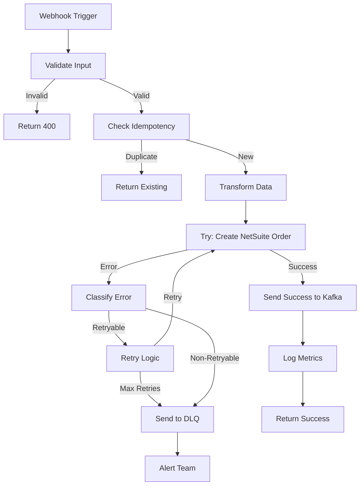

# Workflow Resilience Guide

This document covers best practices for building resilient workflows in n8n.

## Core Principles

1. **Idempotency**: Workflows should produce the same result when executed multiple times
2. **Error Handling**: All failure scenarios should be handled gracefully
3. **Retry Logic**: Transient failures should trigger automatic retries
4. **Dead Letter Queue**: Unrecoverable errors should be logged for manual intervention
5. **Observability**: All workflows should emit metrics and logs

---

## Idempotency

### What is Idempotency?

A workflow is idempotent if executing it multiple times with the same input produces the same result without unwanted side effects.

### Why It Matters

- Retries don't create duplicate records
- Replaying events from Kafka doesn't cause issues
- System is more resilient to failures

### Implementation Patterns

#### Pattern 1: Check-then-Create

```javascript
// n8n Function node
const orderId = $json.orderId;

// Check if order already exists in NetSuite
const existing = await $http.get(`/salesorders?filter=externalId=${orderId}`);

if (existing.items.length > 0) {
  // Already exists, return existing
  return existing.items[0];
} else {
  // Create new order
  return await $http.post('/salesorders', $json);
}
```

#### Pattern 2: Upsert Operations

```javascript
// Use unique external IDs
const payload = {
  externalId: `samsara-${$json.vehicleId}-${$json.timestamp}`,
  ...otherFields
};

// NetSuite will update if exists, create if not
await $http.post('/salesorders', payload);
```

#### Pattern 3: State Tracking

Store execution state in a database:

```sql
CREATE TABLE workflow_executions (
  id UUID PRIMARY KEY,
  workflow_name VARCHAR,
  input_hash VARCHAR UNIQUE,
  output JSONB,
  created_at TIMESTAMP
);
```

---

## Error Handling

### Always Handle Errors

Every HTTP Request node should have error handling configured.

### n8n Error Workflow Pattern

```
[Webhook Trigger]
    ↓
[Try - HTTP Request to API]
    ↓ (on success)
[Success Path] → [Send to Kafka]
    ↓ (on error)
[Error Handler]
    ↓
[If - Is Retryable?]
    ↓ (yes)
[Retry Node] → loops back to HTTP Request
    ↓ (no)
[Send to Dead Letter Queue]
    ↓
[Notify Team] → Slack/Email
```

### Error Classification

```javascript
// n8n Function node - Classify errors
const error = $json.error;
const statusCode = $json.statusCode;

let retryable = false;
let severity = 'low';

// Classify by status code
if (statusCode >= 500 && statusCode < 600) {
  retryable = true;  // Server errors - retry
  severity = 'high';
} else if (statusCode === 429) {
  retryable = true;  // Rate limited - retry with backoff
  severity = 'medium';
} else if (statusCode === 408 || statusCode === 504) {
  retryable = true;  // Timeout - retry
  severity = 'medium';
} else if (statusCode >= 400 && statusCode < 500) {
  retryable = false; // Client error - don't retry
  severity = 'low';
}

return {
  ...json,
  retryable,
  severity,
  errorCategory: retryable ? 'transient' : 'permanent'
};
```

---

## Retry Logic

### Exponential Backoff

```javascript
// n8n Function node - Calculate retry delay
const attempt = $json.retryAttempt || 0;
const maxAttempts = 5;
const baseDelay = 1000; // 1 second

if (attempt >= maxAttempts) {
  return { shouldRetry: false, reason: 'max_attempts_exceeded' };
}

// Exponential backoff: 1s, 2s, 4s, 8s, 16s
const delay = baseDelay * Math.pow(2, attempt);
const jitter = Math.random() * 1000; // Add jitter to avoid thundering herd

return {
  shouldRetry: true,
  delayMs: delay + jitter,
  retryAttempt: attempt + 1
};
```

### Circuit Breaker Pattern

Prevent cascading failures by stopping requests to failing services:

```javascript
// Store in global state or Redis
const failureCount = $workflow.get('apiFailureCount') || 0;
const circuitOpen = $workflow.get('circuitOpen') || false;
const lastFailure = $workflow.get('lastFailureTime');

const FAILURE_THRESHOLD = 5;
const CIRCUIT_TIMEOUT = 60000; // 1 minute

// Check if circuit should reset
if (circuitOpen && Date.now() - lastFailure > CIRCUIT_TIMEOUT) {
  $workflow.set('circuitOpen', false);
  $workflow.set('apiFailureCount', 0);
}

// If circuit is open, fail fast
if (circuitOpen) {
  throw new Error('Circuit breaker open - service unavailable');
}

// Proceed with request...
```

---

## Dead Letter Queue (DLQ)

### When to Use DLQ

Send to DLQ when:
- Maximum retries exceeded
- Unrecoverable error (e.g., 400 Bad Request with invalid data)
- Circuit breaker open for extended period
- Data validation failures

### DLQ Message Format

```json
{
  "dlqReason": "max_retries_exceeded",
  "originalMessage": {
    "orderId": "12345",
    "...": "..."
  },
  "error": {
    "message": "API returned 500",
    "statusCode": 500,
    "attempts": 5
  },
  "metadata": {
    "workflowId": "samsara-to-netsuite",
    "executionId": "abc-123",
    "timestamp": "2026-04-17T12:00:00Z",
    "source": "samsara-webhook"
  }
}
```

### DLQ Workflow

```
[Kafka Consumer - DLQ Topic]
    ↓
[Parse Message]
    ↓
[Store in Database] (for audit trail)
    ↓
[If - Critical Error?]
    ↓ (yes)
[Alert Team] → Slack/PagerDuty
    ↓ (no)
[Log for Later Review]
```

### Manual DLQ Replay

```javascript
// Workflow to manually replay DLQ messages
const dlqMessage = $json;

// Fix the data issue
const fixed = {
  ...dlqMessage.originalMessage,
  // Apply manual fixes here
};

// Retry the original workflow
await $workflow.execute('samsara-to-netsuite', fixed);
```

---

## Observability

### Structured Logging

```javascript
// n8n Function node - Structured log
const log = {
  timestamp: new Date().toISOString(),
  level: 'info',
  workflow: 'samsara-to-netsuite',
  executionId: $executionId,
  event: 'order_created',
  data: {
    orderId: $json.orderId,
    customerId: $json.customerId,
    total: $json.total
  },
  duration_ms: $json.processingTime
};

// Send to Loki or logging service
await $http.post('http://loki:3100/loki/api/v1/push', {
  streams: [{
    stream: { job: 'n8n-workflows' },
    values: [[Date.now() * 1000000, JSON.stringify(log)]]
  }]
});

return $json;
```

### Metrics

Track key metrics for each workflow:

```javascript
// Send metrics to Prometheus Pushgateway
const metric = {
  job: 'n8n-workflows',
  workflow_name: 'samsara-to-netsuite',
  status: 'success', // or 'failure'
  duration_seconds: ($json.endTime - $json.startTime) / 1000
};

await $http.post('http://pushgateway:9091/metrics/job/n8n-workflows', 
  `workflow_duration_seconds{workflow="${metric.workflow_name}",status="${metric.status}"} ${metric.duration_seconds}\n`
);
```

### Health Checks

```javascript
// Workflow health check endpoint
return {
  workflow: 'samsara-to-netsuite',
  status: 'healthy',
  lastExecution: $workflow.get('lastExecutionTime'),
  errorRate: $workflow.get('errorCount') / $workflow.get('totalCount'),
  avgDuration: $workflow.get('avgDuration')
};
```

---

## Complete Example: Resilient Samsara → NetSuite Workflow



### Workflow Configuration

```json
{
  "nodes": [
    {
      "name": "Webhook",
      "type": "n8n-nodes-base.webhook",
      "parameters": {
        "path": "samsara",
        "responseMode": "responseNode"
      }
    },
    {
      "name": "Validate",
      "type": "n8n-nodes-base.function",
      "parameters": {
        "functionCode": "// Validate required fields..."
      }
    },
    {
      "name": "Check Idempotency",
      "type": "n8n-nodes-base.httpRequest",
      "parameters": {
        "url": "http://postgres:5432/check_execution",
        "method": "POST"
      }
    },
    {
      "name": "Create NetSuite Order",
      "type": "n8n-nodes-base.httpRequest",
      "parameters": {
        "url": "https://netsuite-api/salesorders",
        "method": "POST",
        "authentication": "oAuth1",
        "options": {
          "timeout": 30000,
          "retry": {
            "enabled": true,
            "maxTries": 5,
            "waitBetweenTries": 2000
          }
        }
      },
      "continueOnFail": true
    },
    {
      "name": "If Error",
      "type": "n8n-nodes-base.if",
      "parameters": {
        "conditions": {
          "boolean": [
            {
              "value1": "={{$json.error}}",
              "operation": "exists"
            }
          ]
        }
      }
    },
    {
      "name": "Send to DLQ",
      "type": "n8n-nodes-base.kafka",
      "parameters": {
        "topic": "dead-letter-queue",
        "message": "={{JSON.stringify($json)}}"
      }
    }
  ]
}
```

---

## Testing Resilience

### Test Scenarios

1. **Happy Path**: All systems working
2. **Transient Failure**: API returns 500, then 200
3. **Permanent Failure**: API returns 400 Bad Request
4. **Timeout**: API takes 60 seconds
5. **Rate Limiting**: API returns 429
6. **Duplicate Request**: Same event sent twice
7. **Network Partition**: Kafka unavailable
8. **Data Corruption**: Invalid JSON in message

### Testing Tools

```bash
# Simulate API failures with toxic proxy
docker run -d --name toxiproxy \
  -p 8474:8474 -p 8001:8001 \
  ghcr.io/shopify/toxiproxy

# Add latency
toxiproxy-cli toxic add -n latency -t latency -a latency=5000 netsuite-api

# Simulate errors
toxiproxy-cli toxic add -n errors -t http -a status=500 netsuite-api
```

---

## Resources

- [Idempotency Patterns](https://brandur.org/idempotency-keys)
- [Circuit Breaker Pattern](https://martinfowler.com/bliki/CircuitBreaker.html)
- [Retry Best Practices](https://aws.amazon.com/blogs/architecture/exponential-backoff-and-jitter/)
- [n8n Error Handling](https://docs.n8n.io/workflows/error-handling/)
